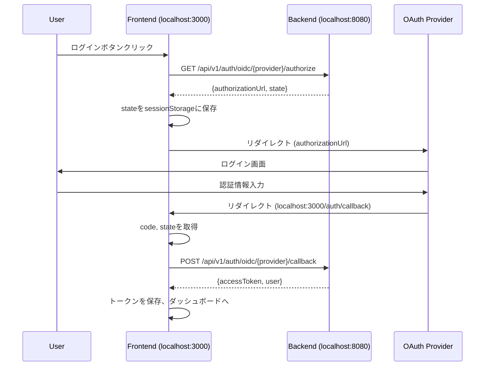

# OAuth認証フロントエンドリダイレクト実装ガイド

## 概要
Google/GitHub OAuth認証のリダイレクトをフロントエンドで受け取る実装に変更します。

## 実装の流れ



## 1. ルーティング設定

### React Router の設定追加

```tsx
// App.tsx または Routes設定ファイル
import { OAuthCallback } from './pages/OAuthCallback';

function App() {
  return (
    <BrowserRouter>
      <Routes>
        {/* 既存のルート */}
        
        {/* OAuth コールバックルート追加 */}
        <Route path="/auth/callback" element={<OAuthCallback />} />
        <Route path="/auth/google/callback" element={<OAuthCallback />} />
        <Route path="/auth/github/callback" element={<OAuthCallback />} />
      </Routes>
    </BrowserRouter>
  );
}
```

## 2. OAuth コールバックコンポーネント実装

### `/src/pages/OAuthCallback.tsx`

```tsx
import React, { useEffect, useState } from 'react';
import { useNavigate, useSearchParams, useLocation } from 'react-router-dom';
import { authService } from '../services/AuthService';

export const OAuthCallback: React.FC = () => {
  const navigate = useNavigate();
  const [searchParams] = useSearchParams();
  const location = useLocation();
  const [error, setError] = useState<string>('');
  const [processing, setProcessing] = useState(true);

  useEffect(() => {
    const handleCallback = async () => {
      try {
        // URLパラメータから code と state を取得
        const code = searchParams.get('code');
        const state = searchParams.get('state');
        const error = searchParams.get('error');
        const errorDescription = searchParams.get('error_description');

        // エラーレスポンスの処理
        if (error) {
          console.error('OAuth error:', error, errorDescription);
          setError(errorDescription || 'OAuth認証がキャンセルされました');
          setProcessing(false);
          return;
        }

        // code と state の検証
        if (!code || !state) {
          setError('認証パラメータが不足しています');
          setProcessing(false);
          return;
        }

        // sessionStorage から保存した state を取得
        const savedState = sessionStorage.getItem('oauth_state');
        const provider = sessionStorage.getItem('oauth_provider');

        if (!savedState || !provider) {
          setError('セッション情報が見つかりません');
          setProcessing(false);
          return;
        }

        // state の検証
        if (state !== savedState) {
          setError('セキュリティエラー: stateが一致しません');
          setProcessing(false);
          return;
        }

        // プロバイダーの判定（URLパスから）
        let detectedProvider = provider;
        if (location.pathname.includes('/google/')) {
          detectedProvider = 'google';
        } else if (location.pathname.includes('/github/')) {
          detectedProvider = 'github';
        }

        // バックエンドにコールバック情報を送信
        const response = await authService.handleOAuthCallback(
          detectedProvider,
          code,
          state
        );

        // 成功時の処理
        // トークンを保存
        localStorage.setItem('accessToken', response.accessToken);
        if (response.refreshToken) {
          localStorage.setItem('refreshToken', response.refreshToken);
        }

        // sessionStorage をクリーンアップ
        sessionStorage.removeItem('oauth_state');
        sessionStorage.removeItem('oauth_provider');

        // ダッシュボードへリダイレクト
        navigate('/dashboard', { replace: true });

      } catch (error) {
        console.error('OAuth callback error:', error);
        setError('認証処理中にエラーが発生しました');
        setProcessing(false);
      }
    };

    handleCallback();
  }, [searchParams, location, navigate]);

  if (processing) {
    return (
      <div className="oauth-callback-container">
        <div className="processing">
          <h2>認証処理中...</h2>
          <div className="spinner"></div>
          <p>しばらくお待ちください</p>
        </div>
      </div>
    );
  }

  if (error) {
    return (
      <div className="oauth-callback-container">
        <div className="error">
          <h2>認証エラー</h2>
          <p className="error-message">{error}</p>
          <button onClick={() => navigate('/login', { replace: true })}>
            ログイン画面に戻る
          </button>
        </div>
      </div>
    );
  }

  return null;
};
```

## 3. 認証サービスの更新

### `/src/services/AuthService.ts`

```typescript
export class AuthService {
  private static API_BASE_URL = process.env.REACT_APP_API_BASE_URL || 'http://localhost:8080/api/v1';

  /**
   * OAuth認証を開始
   */
  static async initiateOAuth(provider: 'google' | 'github'): Promise<OAuthInitResponse> {
    try {
      const response = await axios.get(
        `${this.API_BASE_URL}/auth/oidc/${provider}/authorize`
      );
      
      const data = response.data;
      
      // state と provider を sessionStorage に保存
      sessionStorage.setItem('oauth_state', data.state);
      sessionStorage.setItem('oauth_provider', provider);
      
      return data;
    } catch (error) {
      console.error(`Failed to initiate ${provider} OAuth:`, error);
      throw error;
    }
  }

  /**
   * OAuthコールバックを処理
   */
  static async handleOAuthCallback(
    provider: string,
    code: string,
    state: string
  ): Promise<AuthResponse> {
    try {
      const response = await axios.post(
        `${this.API_BASE_URL}/auth/oidc/${provider}/callback`,
        {
          code,
          state,
          // error と errorDescription は必要に応じて
        }
      );
      
      return response.data;
    } catch (error) {
      console.error('OAuth callback failed:', error);
      throw error;
    }
  }
}
```

## 4. ログインコンポーネントの更新

### `/src/components/Login.tsx`

```tsx
const handleSocialLogin = async (provider: 'google' | 'github') => {
  try {
    setLoading(true);
    
    // OAuth認証を開始
    const { authorizationUrl } = await AuthService.initiateOAuth(provider);
    
    // OAuth プロバイダーへリダイレクト
    window.location.href = authorizationUrl;
    
  } catch (error) {
    console.error(`${provider} login failed:`, error);
    setError(`${provider}ログインの開始に失敗しました`);
    setLoading(false);
  }
};
```

## 5. 環境変数の設定

### `.env.local` (フロントエンド)

```env
# API設定
REACT_APP_API_BASE_URL=http://localhost:8080/api/v1

# OAuth リダイレクト設定
REACT_APP_OAUTH_REDIRECT_BASE=http://localhost:3000/auth
```

## 6. CSS スタイル例

### `/src/styles/OAuthCallback.css`

```css
.oauth-callback-container {
  display: flex;
  justify-content: center;
  align-items: center;
  min-height: 100vh;
  background-color: #f5f5f5;
}

.processing, .error {
  background: white;
  padding: 2rem;
  border-radius: 8px;
  box-shadow: 0 2px 10px rgba(0, 0, 0, 0.1);
  text-align: center;
  max-width: 400px;
  width: 100%;
}

.spinner {
  margin: 2rem auto;
  width: 50px;
  height: 50px;
  border: 3px solid #f3f3f3;
  border-top: 3px solid #3498db;
  border-radius: 50%;
  animation: spin 1s linear infinite;
}

@keyframes spin {
  0% { transform: rotate(0deg); }
  100% { transform: rotate(360deg); }
}

.error-message {
  color: #e74c3c;
  margin: 1rem 0;
}

button {
  background-color: #3498db;
  color: white;
  border: none;
  padding: 0.75rem 1.5rem;
  border-radius: 4px;
  cursor: pointer;
  font-size: 1rem;
  transition: background-color 0.3s;
}

button:hover {
  background-color: #2980b9;
}
```

## 7. エラーハンドリングとセキュリティ

### 実装時の注意点

1. **State パラメータの検証**
   - 必ず sessionStorage に保存した state と一致することを確認
   - 一致しない場合は CSRF 攻撃の可能性があるため処理を中断

2. **エラーハンドリング**
   - OAuth プロバイダーからのエラー（error, error_description）
   - ネットワークエラー
   - バックエンドエラー（401, 403, 500 など）

3. **トークン管理**
   - アクセストークンは localStorage または secure cookie に保存
   - リフレッシュトークンは必要に応じて保存
   - ログアウト時は必ずクリア

4. **リダイレクト後のクリーンアップ**
   - sessionStorage から一時データを削除
   - URL からクエリパラメータを削除（history.replaceState）

## 8. テスト手順

1. ログイン画面で「Googleでログイン」ボタンをクリック
2. Google の認証画面にリダイレクトされることを確認
3. Google でログイン完了後、`http://localhost:3000/auth/callback?code=...&state=...` にリダイレクトされることを確認
4. 自動的にバックエンドにコールバック情報が送信され、ダッシュボードに遷移することを確認
5. localStorage にトークンが保存されていることを確認

## トラブルシューティング

### よくある問題と解決方法

1. **「リダイレクト URI が一致しません」エラー**
   - Google/GitHub の OAuth アプリ設定で、リダイレクト URI を `http://localhost:3000/auth/callback` に更新

2. **CORS エラー**
   - バックエンドの CORS 設定を確認
   - フロントエンドのオリジン（http://localhost:3000）が許可されているか確認

3. **State が一致しないエラー**
   - ブラウザの開発者ツールで sessionStorage を確認
   - 複数タブで認証を試みていないか確認

---

実装後は、バックエンド側の OAuth アプリ設定（Google Cloud Console、GitHub Settings）でリダイレクト URI を更新することを忘れずに行ってください。